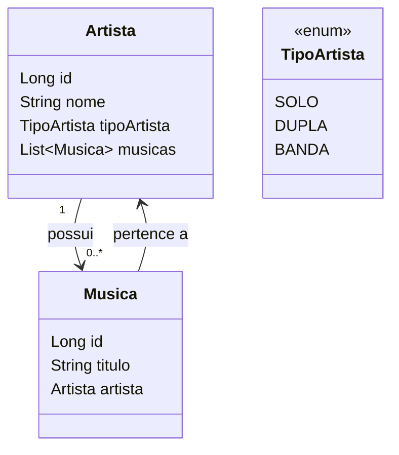

# 🎙 Music App Alura

##  Descrição do Projeto

Este projeto é uma aplicação Java com Spring Boot que permite armazenar dados de artistas e músicas em um banco de dados relacional. Além disso, integra-se com a API do Gemini para buscar informações adicionais sobre os artistas.

## 🚀 Funcionalidades

- ✅ Cadastrar Artista
- ✅ Cadastrar Música
- ✅ Pesquisar Música por Artistas
- ✅ Listar Todos os Artistas
- ✅ Pesquisar Artista (via API Gemini)

## Princípais Classes

- **Artista**
  - Atributos: `id`, `nome`, `tipo` (enum `TipoArtista`)
  - Relacionamento: Um artista pode ter várias músicas (1:N)

- **TipoArtista (Enum)**
  - Valores possíveis: `SOLO`, `DUPLA`, `BANDA`

- **Musica**
  - Atributos: `id`, `titulo`, `artista` (referência ao artista)

- **Main**
  - Responsável por exibir o menu e chamar as operações de CRUD para artistas e músicas

##  Diagrama de Classes (Mermaid)

## 🛠️ Tecnologias Utilizadas

- Java 11+
- Spring Boot
- Spring Data JPA
- PostgreSQL
- API Gemini (Google AI)
- Dotenv Java
